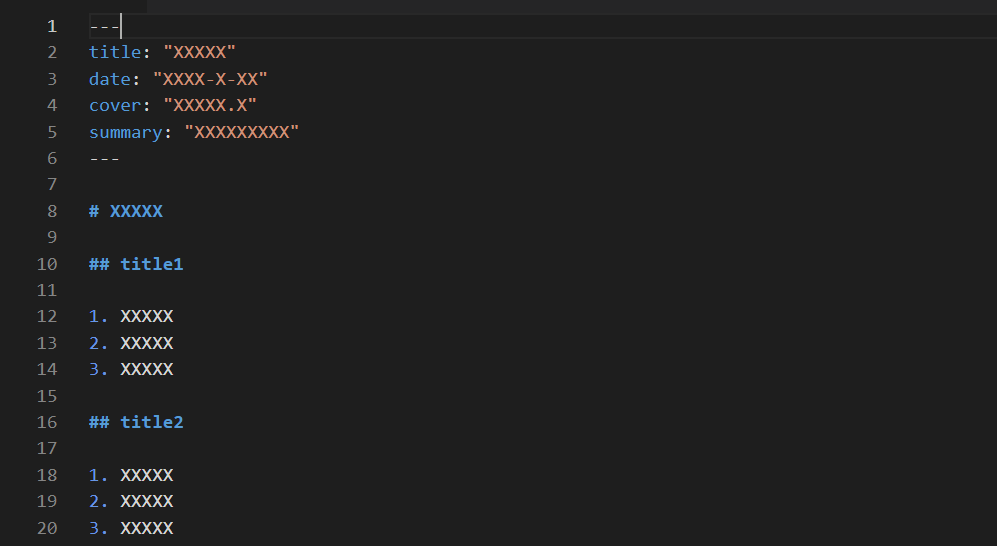

# React 个人博客


## 项目功能分析

1. 实现博客书写与展示
2. Markdown书写博客

## 技术栈

1. redux
2. react
3. webpack
4. koa
5. mongodb

## 项目骨架

## 前端部分

## 后台部分

## 公共部分划分

## 博客信息存储

1. 文章按照类型，分目录进行存储
2. 文章存储格式——markdown文件
3. 文章开头存储文章头信息，利用特殊标识与内容分离


```tree
blog
├── type1
│   ├── article1.md
│   ├── article2.md
│   └── article3.md
├── type2
│   ├── article1.md
│   ├── article2.md
│   └── article3.md
└── type3
    ├── article1.md
    ├── article2.md
    └── article3.md
```

> 需求：博客列表ALL(头信息)/博客列表分类(头信息)/博客列表分时间(头信息)/博客(整体信息)

### 构想1

#### 后台

```javascript
    {
      title:"XXXXX",
      date:"XXXX-XX-XX",
      cover: "XXXXX.XXX",
      summary: "XXXXXXXXXX",

      content:"XXXXXXXXXXXXXX"
    }
```

1. 遍历source 文档存储目录

2. 将博客信息 头信息/内容 全部存储到一个对象中，将所有文章存储到一个数组中。

3. 遍历数组，并形成按照类型分类的数组A，和按照年限分类的数组B

4. 将上述操作形成的数据存储到数据库中

#### 前端

1. 前端路由进入全部文章页面/按类型分类文章页面/按日期分类文章页面.进入页面后利用ajax进行数据获取，渲染页面

2. 文章展示页面，通过list的props传递文章内容，在前端进行markdown内容解析与渲染

> 缺点： 每次进入一个分类页面就要进行http请求，markdown文章在前端渲染依赖于客户端用户状况。

### 构想2

1. 服务器端返回全部文章信息
2. 客户端接受数据，并进行分类存储存储进Store中 Vuex/Redux，并进行分类
3. 客户端渲染markdown页面

### 构想3

1. 服务器存储文章头信息
2. 客户端接收数据，进行分类