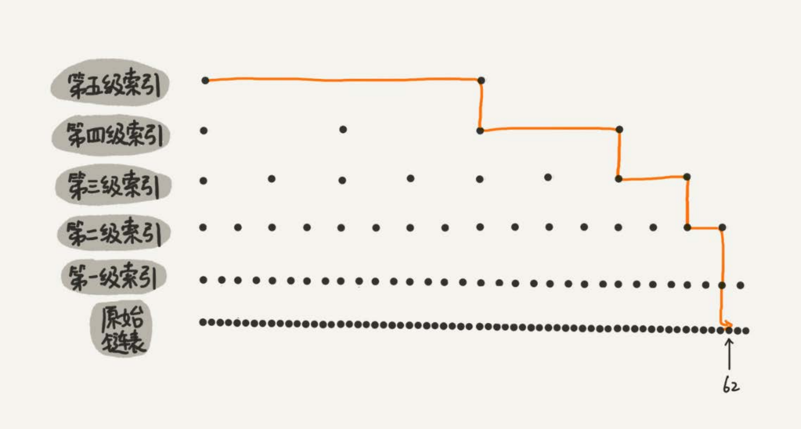
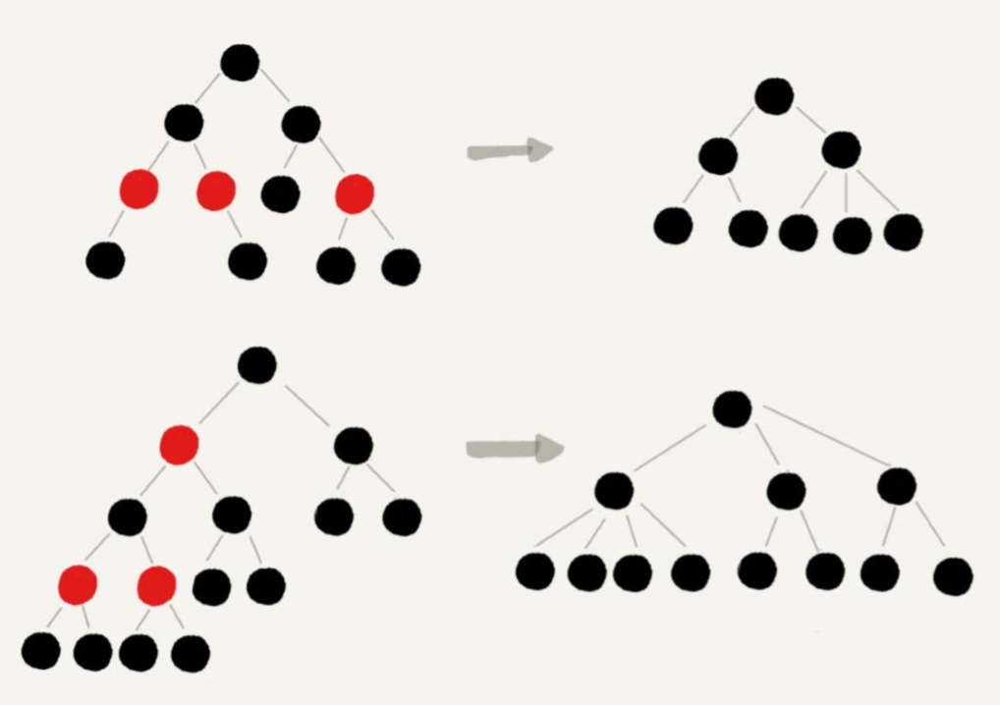
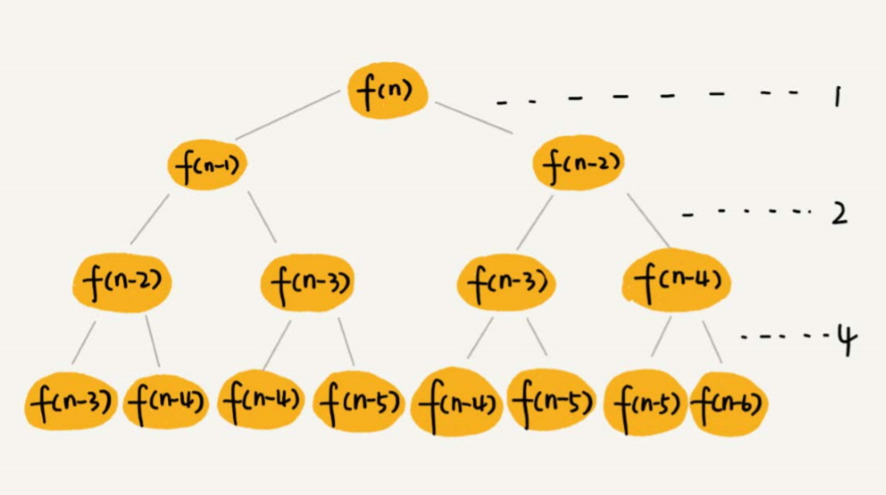

# 数据结构与算法之美(三)

学习该专栏第三周(4.8 日)，清明节收假。

## Day4.8

### 跳表

在链表的基础上增加索引，增加查找效率



#### 空间复杂度

O(n)

#### 查找、增加、删除时间复杂度

O(logn)

### 散列表

散列表用的就是数组支持按照下标随机访问的时候，时间复杂度是 O(1)的特性。我们通过散列函数把元素的键值映 射为下标，然后将数据存储在数组中对应下标的位置。当我们按照键值查询元素时，我们用同样的散列函数，将键值转化数组下标，从对应的数组下标的位置取 数据。

#### 散列函数 hash（key）

我们可以把它定义成 hash(key)，其中 key 表示元素的键值，hash(key)的值表示经过散列函数计算得到的散列值

##### 设计要求

1. 散列函数计算得到的散列值是一个非负整数
2. 如果 key1 = key2，那 hash(key1) == hash(key2)；
3. 如果 key1 ≠ key2，那 hash(key1) ≠ hash(key2)

#### 散列冲突

##### 开放寻址法

如果出现了散列冲突，我们就重新探测一个空闲位置，将其插入

1. 线性探测
2. 二次探测
3. 双重散列

##### 链表法

#### 结合

1. 链表/双向链表
2. 红黑树/avl 数
3. 跳表

#### 课后题

1. 假设我们有 10 万条 URL 访问日志，如何按照访问次数给 URL 排序?

2. 有两个字符串数组，每个数组大约有 10 万条字符串，如何快速找出两个数组中相同的字符串？

## 4.9

### 哈希算法

#### 哈希算法要求

1. 从哈希值不能反向推导出原始数据（所以哈希算法也叫单向哈希算法）
2. 对输入数据非常敏感，哪怕原始数据只修改了一个 Bit，最后得到的哈希值也大不相同
3. 散列冲突的概率要很小，对于不同的原始数据，哈希值相同的概率非常小
4. 哈希算法的执行效率要尽量高效，针对较长的文本，也能快速地计算出哈希值

#### 哈希算法应用

1. 唯一标识，哈希算法可以对大数据做信息摘要，通过一个较短的二进制编码来表示很大的数据
2. 校验数据的完整性和正确性
3. 安全加密
4. 散列(hash)函数
5. 负载均衡
6. 数据分片
7. 分布式存储

## 4.10

### 二叉树

1. 普通二叉树
2. 满二叉树
3. 完全二叉树
4. 平衡二叉树

#### 课后问题

求出一棵给定二叉树的确切高度呢

```js
function getHeight(root) {
  return __getHeight(root, 0)

  var __getHeight = (function() {
    var maxHeight = 0
    function getH(root, n) {
      if (root === null) maxHeight = Math.max(maxHeight, n)
      getH(root.left, n + 1)
      getH(root.right, n + 1)
    }

    return function(root, n) {
      getH(root, n)
      return maxHeight
    }
  })()
}
```

## 4.11

### 红黑树

近似于平衡二叉树

1. 根节点为黑色
2. 红色节点不能相连
3. 叶子节点都是黑色
4. 从根节点到任意叶子节点经过的黑色节点数都相同

根据上述性质


去掉红色节点，红黑树变成一颗满二叉树高度为 log(nblack)
根据红黑树性质，二叉树至多高度为 2long(nblack)

## 4.12

### 递归树

利用递归树分析斐波那契数列的时间复杂度

````js
function f(n) {  
  if (n == 1) return 1  
  if (n == 2) return 2  
  return f(n-1) + f(n-2)
}
````



经分析，生成的递归树高度最多为n层，每层需要耗时 2^(k-1)`k为层数`
所以整体时间复杂度为`1 + 2 + 4 + .... 2^(n-1)`
