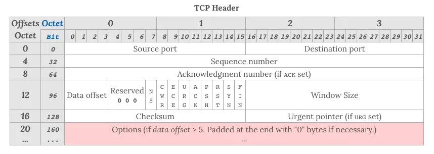
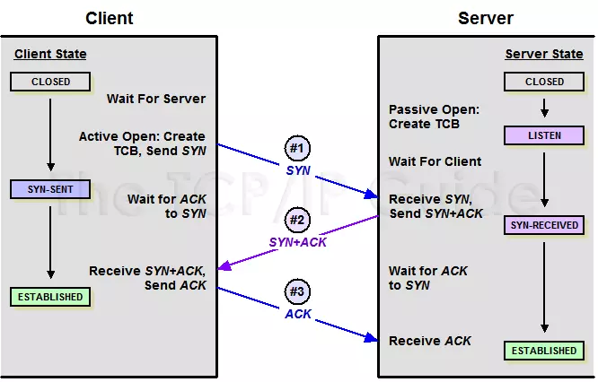

# TCP协议

## TCP特点

1. 位于传输层，面向连接的全双工网络协议

2. 通过各种算法保证数据可靠

3. 开启断开都要进行握手

## TCP 和 UDP  区别联系

### 联系

双方都是位于传输层的网络协议

### 区别

1. TCP面向连接，UDP面向无连接
2. TCP有多种机制保证数据可靠(三次握手、ARQ)、有序并进行流量控制(滑动窗口)`TCP比UDP头部信息多样`
3. UDP 协议只是数据报文的搬运工，不保证有序且不丢失的传递到对端
4. TCP大小无限制,UDP大小有限制(65535)
5. UDP比TCP轻便、高效

### UDP 头部信息

1. 源端口
2. 目标端口
3. 包长度
4. 校验和

#### 校验

## TCP 主要头部信息

TCP以段MSS为单位发送数据

### Sequence number(SEQ)

报文序号，保证TCP传输报文有序，对端可以通过序号的顺序拼接报文

### Acknowledgement Number(ACK)

该序号表示，期望收到的下一个报文序号，同时表明已经成功收到上一次报文

### WINDOW SIZE

窗口大小，表示还能接受多少字节数据，用于流量控制

### 标识符

#### ack，ack  

`ack = 0,syn = 1`表明连接请求报文  
`ack = 1,syn = 1`表明同意建立连接的应答报文  
当建立连接之后,每次报文中 `ack = 1`

#### fin

`fin = 1`表明释放连接的请求报文

#### urg

`urg = 1`表明该报文富含紧急信息，优先级较高

#### psh  

`psh = 1`表明接收端应该立即将数据 push 给应用层，而不是等到缓冲区满后再提交。

#### rst

`rst = 1`表明当前 TCP 连接出现严重问题，可能需要重新建立 TCP 连接，也可以用于拒绝非法的报文段和拒绝连接请求  

## 三次握手

1. 客户端向服务端发送`SEQ = X;syn = 1, ack = 0;` 请求建立连接，客户端进入`syn-send状态`

2. 服务端收到之后，向客户端回复`ACK = X + 1,SEQ = Y;syn = 1, ack = 1;` 表明同意建立连接，服务端进入`syn-recived状态`

3. 客户端收到回复，向服务端发送`ACK = Y + 1,SEQ = X + 1; ack = 1;` 客户端进入`ESTABLISHED状态`，服务端收到应答也进入`ESTABLISHED状态`

### 三次握手目的

#### 状态统一,客户端服务端都能确认双方具有`收发数据包`能力

#### 避免脏链接  

#### 确定MSS最大消息长度

最理想情况，最大消息长度正好是IP中不会被分片处理的最大数据长度

若客户端发送连接`请求1`，由于网络原因`请求1`未能到达服务端  

客户端再次发送`请求2`,服务端收到`请求2`回复`响应2`并进入`ESTABLISHED`，客户端收到响应进入`ESTABLISHED`,通信结束，断开连接

此时服务端收到`请求1`，再次进入`ESTABLISHED`，并回复`响应1`，客户端收到`响应1`认为过期请求直接丢弃  

而此时服务端一直开启连接，浪费资源

## 四次挥手

1. 客户端向服务端发送`FIN = 1`表明请求断开连接

2. 服务端收到断开连接请求，则发送`ack` 表明同意断开，并进入`close_wait`状态，客户端收到`ack`之后，从客户端向服务端通信就断开了，客户端不再发送数据，而此时由于`TCP`是全双工协议，服务端仍可以向客户端发送数据

3. 服务端数据发送完毕，向客户端发送`FIN = 1`表明请求断开连接，并进入`last_ack`状态

4. 客户端收到释放请求，向服务端发送确认应答`ack`，并进入`time_close`状态，经过2MSL后，进入`close`状态，服务端收到该数据包也进入`close`状态

### TIME-WAIT 状态存在意义

若客户端接受到释放请求，向客户端发送确认应答`ack`后，直接进入`close`状态，则服务端有可能收不到`ack`包，无法进行正常关闭

## ARQ协议

超时传输机制

### 停止等待 ARQ

只要 A 向 B 发送一段报文，都要停止发送并启动一个定时器，等待对端回应，在定时器时间内接收到对端应答就取消定时器并发送下一段报文  

### 连续 ARQ

在连续 ARQ 中，发送端拥有一个发送窗口，可以在没有收到应答的情况下持续发送窗口内的数据，这样相比停止等待 ARQ 协议来说减少了等待时间，提高了效率  

## 滑动窗口

TCP 中两端都维系着窗口：发送窗口和接受窗口
TCP通过滑动窗口进行流量控制  

### 发送窗口

发送窗口包含：

1. 已经发送但未收到响应的数据
2. 未发送的数据

发送窗口大小由`接收窗口大小`和`网络状况决定`

### 接收窗口

接收方会把当前接收窗口的`剩余大小`写入应答报文

发送端收到应答后根据该值和当前网络拥塞情况设置`发送窗口`的大小，所以发送窗口的大小是不断`变化`的