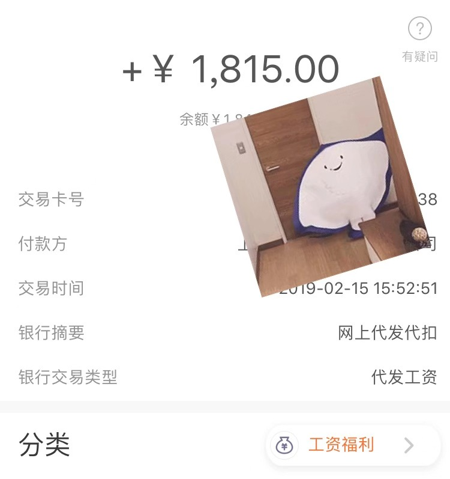

# 程序员生涯第一份工资

先贴图！  

1.17——1.31，工作日11天，每天工资150元，餐补15元，合计1815元。对作为学生的我来说算是一笔蛮大的数字了。

回顾自己二十年来，凭自己之力赚来的钱真的是用手指都可以清晰的数出来。

## 来源于父亲的第一次工资

小学的时候。自己的零花钱每次都是要买零食，买文具，有正当理由向父母索要，这样一来我也并没有攒过钱。

直到有一天，忘记时自己看到了一款价值不菲的玩具还是突然心血来潮，向父亲狮子大开口索要(15元)。

那时候15元对我可不是一笔小款，父亲也没有被我这一个狮子大开口所惊到，而是让我去`做家务`,来换这笔钱。  

虽然我最终也没有做多少家务，但也成功拿到了这笔钱，在那时，我还没有工资的概念，现在看来那算是我第一份工资吧，来源于我的父亲。
